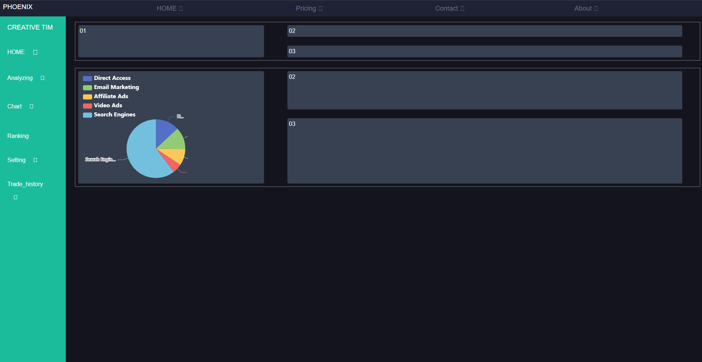

# corptia-nuxt

## Build Setup

```bash
# install dependencies with npm 
$ npm install

# run the project in developer environment 
$ npm run dev

```
## Preview



## introduction
  this is the **vue dahboard** specially designed for helping traders to handle their crypto future trading  easily. APi for connecting to bingX exchange are reserved and also for multiple view tradingview chart(emdeded) platform is written to have a `ncie` view of movement of the market.


## Main_sections
1. Trade API(`BINGX`).
2. Multi window emdeded chart.
3. Analyzing Trade section.
4. ...
   
  
